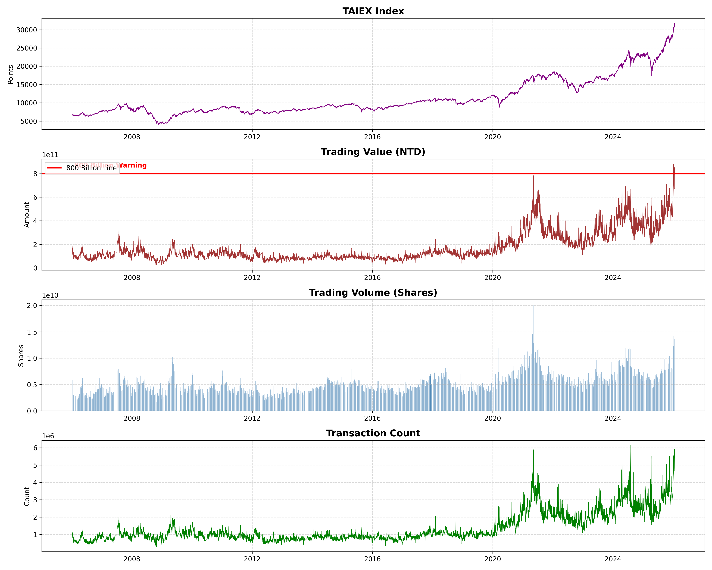
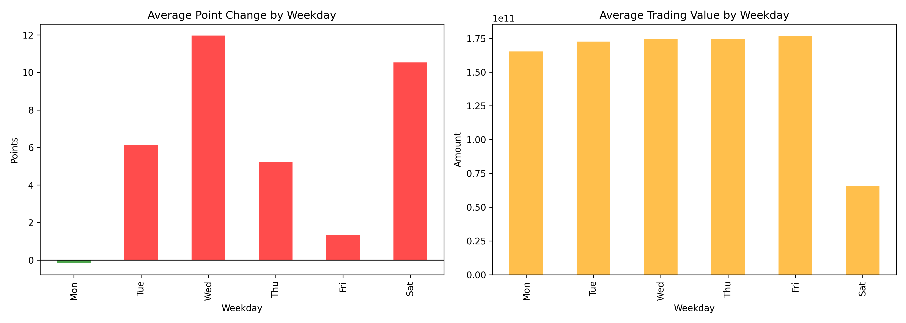
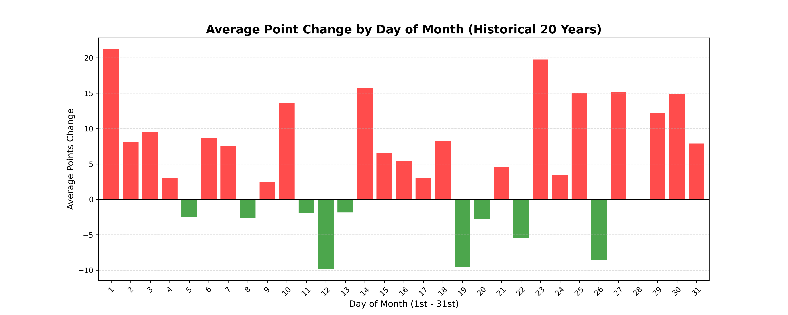
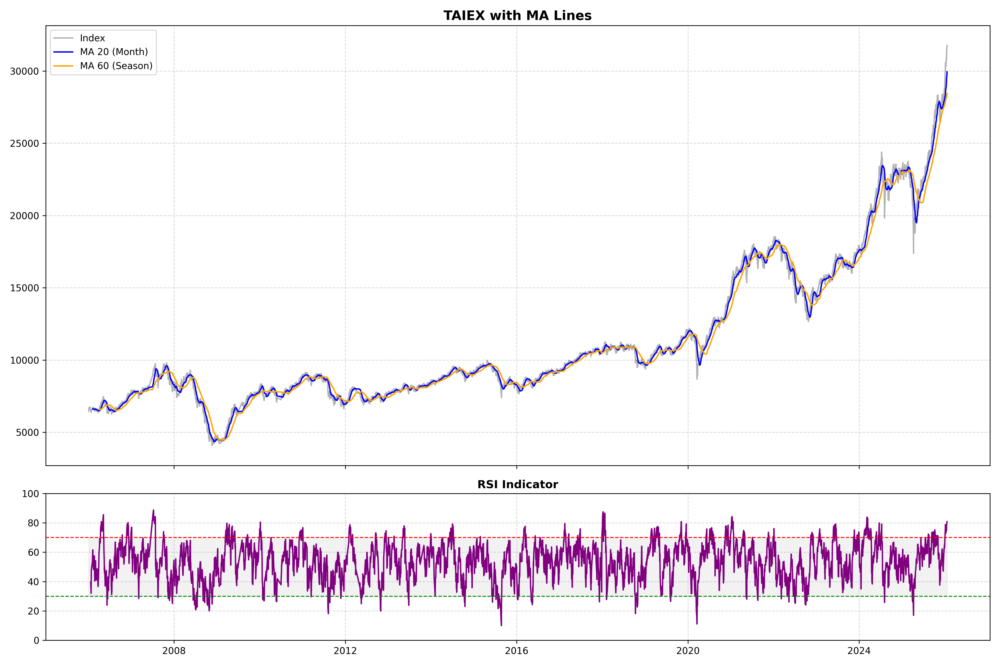

# 📈 台股歷史市場慣性分析 (Taiwan Stock Market Analysis)

## 專案簡介 (Introduction)
本專案利用 Python 針對台灣證券交易所 (TWSE) 近 20 年 (民國 95-115 年) 的每日成交資訊進行自動化擷取與分析。

身為具備經濟學與統計背景的分析者，我試圖透過數據驗證常見的市場假說，如「星期效應 (Weekday Effect)」與「日曆效應 (Calendar Effect)」，並利用量化數據尋找適合定期定額的投入時間點。

## 核心功能 (Key Features)
* **自動化爬蟲 (ETL)**：
    * 透過 `Requests` 串接證交所 API。
    * 實作反爬蟲機制 (Sleep) 與民國年/西元日期自動轉換邏輯。
    * 資料清洗：處理千分位符號、異常值 (NaN) 與資料型態轉換。
* **數據分析 (EDA)**：
    * 分析加權指數、成交金額、成交量之間的相關性。
    * 利用 `GroupBy` 統計每週與每月的市場漲跌慣性。
* **視覺化 (Visualization)**：
    * 繪製多軸趨勢圖 (Subplots) 呈現市場長期走勢。
    * 設定「8000億天量」警戒線與視覺化標註。

## 分析洞察 (Key Insights)
### 1. 星期效應 (The Weekday Effect)

* **觀察**：統計顯示週一平均跌幅最大，週二通常伴隨反彈。

* **推論**：這符合行為金融學中的「藍色星期一」假說，週末累積的負面資訊傾向在週一宣洩。

### 2. 最佳定期定額扣款日 (Best DCA Day)

* **觀察**：每月 12 號 或 19-20 號附近常出現較大的平均跌幅（綠棒）。

* **策略**：建議避開月初（1-4號）的發薪日買盤，改於月中回檔時扣款，長期可望優化持倉成本。

### 3. MA (移動平均)&RSI (相對強弱指標)

* MA (移動平均)：「平滑化 (Smoothing)」，用來消除雜訊看趨勢。

* RSI (相對強弱指標)：「動能 (Momentum) 與常態分佈」概念，看現在是不是乖離太遠（過熱或過冷）。

## 使用技術 (Tech Stack)
* **Language**: Python 3
* **Libraries**: `pandas`, `requests`, `matplotlib`, `seaborn`, `re`

## 如何執行 (How to Run)
1. 下載本專案的 `證交所資料.ipynb`。
2. 使用 Google Colab 開啟。
3. 執行程式碼即可重現所有圖表。

---
**Author**: Ping-Hsun Shen
**Contact**: X: @ArtemisCastell
